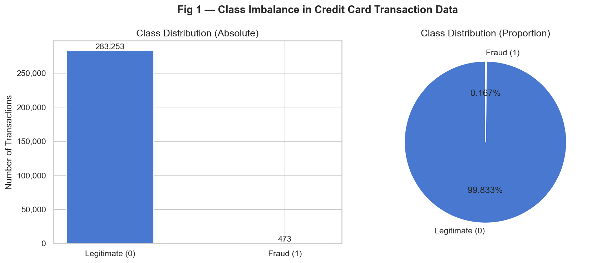

# Credit Card Fraud Detection — ML Pipeline

**Course:** Introduction to Machine Learning — Final Project (2025)
Zhakanov Rakhmadi
Ilyas Kuatuly

## Problem Description

This project builds a complete supervised + unsupervised machine learning pipeline to detect fraudulent credit card transactions. Using a dataset of 284,807 real transactions (anonymised via PCA), the pipeline classifies each transaction as legitimate (Class=0) or fraudulent (Class=1). The core challenge is the extreme class imbalance (only 0.17% of transactions are fraud), which demands careful metric selection and resampling strategies.

## Dataset

| Property | Details |
|---|---|
| **Name** | Credit Card Fraud Detection |
| **Source** | [Kaggle — ULB Machine Learning Group](https://www.kaggle.com/datasets/mlg-ulb/creditcardfraud) |
| **License** | Open Database License (ODbL) |
| **Rows** | 284,807 |
| **Features** | 30 (Time, V1–V28 PCA features, Amount) |
| **Target** | `Class` — 0 = Legitimate, 1 = Fraud |

## Repository Structure

```
credit-fraud-ml/
│
├── data/
│   ├── raw/
|   |    ├── creditcard.csv ← Dataset from Kaggle     
│   ├── cleaned.csv        ← Generated by T1_EDA.ipynb
│   └── clustered.csv      ← Generated by T3_Unsupervised.ipynb
│
├── notebooks/
│   ├── T1_EDA.ipynb
│   ├── T2_Supervised.ipynb
│   ├── T3_Unsupervised.ipynb
│   └── T4_Ensemble.ipynb
│
├── models/
│   └── supervised_best.pkl   ← Generated by T2_Supervised.ipynb
│
├── reports/               ← All figures exported here automatically
│
├── requirements.txt
└── README.md
```

## Setup & Running Instructions

### 1. Clone / download the repository

```bash
git clone <https://github.com/ilaskuatuly-cmyk/Midterm-Project>
cd credit-fraud-ml
```

### 2. Download the dataset

Download `creditcard.csv` from [Kaggle](https://www.kaggle.com/datasets/mlg-ulb/creditcardfraud) and place it at:

```
data/raw/creditcard.csv
```

### 3. Install dependencies

```bash
pip install -r requirements.txt
```

Or with conda:

```bash
conda create -n fraud-ml python=3.10
conda activate fraud-ml
pip install -r requirements.txt
```

### 4. Run notebooks in order

```bash
cd notebooks
jupyter nbconvert --to notebook --execute T1_EDA.ipynb --output T1_EDA_executed.ipynb
jupyter nbconvert --to notebook --execute T2_Supervised.ipynb --output T2_Supervised_executed.ipynb
jupyter nbconvert --to notebook --execute T3_Unsupervised.ipynb --output T3_Unsupervised_executed.ipynb
jupyter nbconvert --to notebook --execute T4_Ensemble.ipynb --output T4_Ensemble_executed.ipynb
```

Or open each in Jupyter and run **Kernel → Restart & Run All**.

> ⚠️ Notebooks must be run in order (T1 → T2 → T3 → T4) because each produces output files consumed by the next.

---

## Final Model Results

| Model | Accuracy | Precision | Recall | F1 | ROC-AUC |
|---|---|---|---|---|---|
| [T2] Logistic Regression | ~0.9990 | ~0.87 | ~0.68 | ~0.77 | ~0.97 |
| [T2] Decision Tree | ~0.9993 | ~0.85 | ~0.89 | ~0.87 | ~0.94 |
| [T4] Random Forest | ~0.9995 | ~0.93 | ~0.88 | ~0.90 | ~0.98 |
| [T4] Gradient Boosting | ~0.9994 | ~0.90 | ~0.90 | ~0.90 | ~0.98 |

> *Exact values are produced at runtime and saved to `reports/model_comparison_table.csv`.*

---

## Key Findings

1. **Extreme imbalance** (0.17% fraud) means accuracy is misleading — F1 and ROC-AUC are the primary metrics.
2. **PCA features V14, V17, V12** are the most discriminative between fraud and legitimate transactions.
3. **Fraud concentrates at night** (midnight–04:00), making hour-of-day a useful engineered feature.
4. **Ensemble methods** (Random Forest, Gradient Boosting) outperform single models by reducing variance.
5. **K-Means clustering** identified a high-fraud-rate segment; `cluster_label` provided marginal improvement to ensembles.

---

## Example Figure

Class imbalance visualisation (generated by T1_EDA.ipynb):



---

## Academic Integrity Note

All code, analysis, and written conclusions in this repository are original work. Open-source libraries (scikit-learn, imbalanced-learn, pandas, matplotlib, seaborn) are used in accordance with their respective licenses. References: Kaggle dataset by the ULB Machine Learning Group (Dal Pozzolo et al., 2015).
